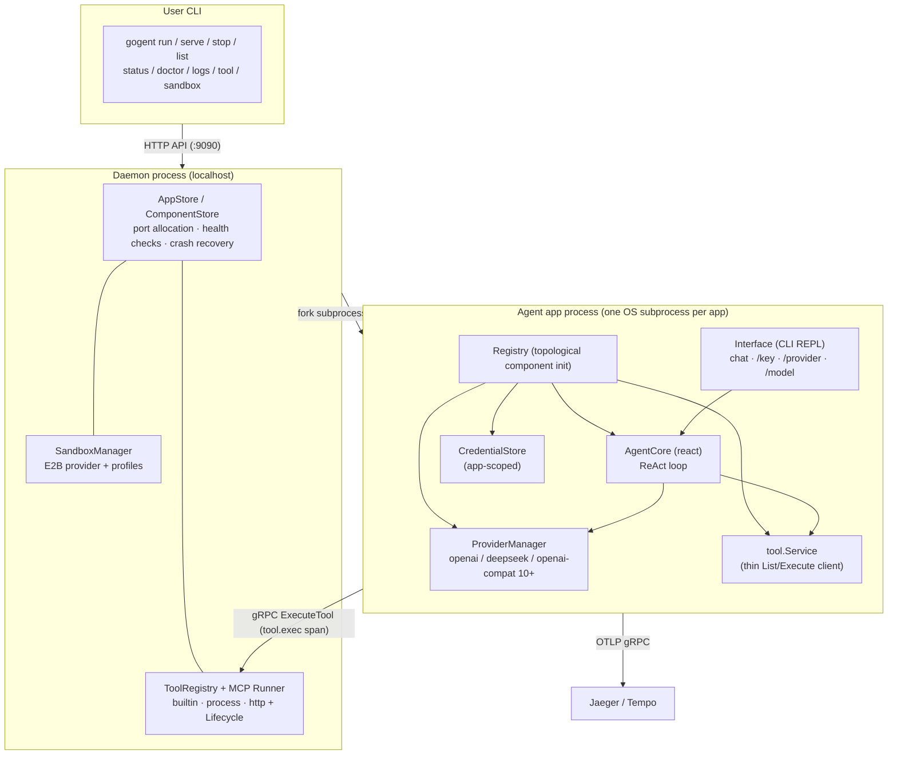

# Gogent — Go Agent Infrastructure

**English** | [中文](README.zh.md)

Gogent is a Go-based **agent application harness**. It does not write your agent's business logic for you — instead it provides a pluggable component system, multi-engine LLM providers, a ReAct agent loop, multi-application daemon management, a centralized tool registry, and sandboxed tool execution, letting you assemble, run, and operate agent applications declaratively from a single YAML file.

```
go get github.com/tltre/gogent
```

## Features

- **Modular component architecture** — 9 subsystems implemented as components (channel / agentcore / provider / hook / eventbus / contextmanager / memory / sandbox / logger), assembled declaratively via YAML; every component is pluggable, replaceable, and multi-instance capable
- **Multi-engine LLM providers** — built-in OpenAI and DeepSeek engines, plus 10+ OpenAI-compatible vendors (Groq, Mistral, Ollama, vLLM, ...) through a shared base class; switch engines at runtime with `/provider` `/model`; model lists are fetched dynamically, never hardcoded
- **ReAct agent** — full ReAct loop (reason → tool call → observe → iterate) with automatic tool declaration injection, result feedback, error self-correction, iteration caps, and context/memory persistence
- **Multi-application daemon management** — independent OS subprocess isolation; the daemon allocates ports, monitors lifecycle, detects and recovers crashes; agents keep running even if the daemon dies
- **Centralized tool registry** — tools are registered and authorized by the daemon; apps consume them declaratively via a manifest (least privilege); app-level `securityLevel` plus global rules
- **MCP tool ecosystem** — process / http dual MCP servers, automatic sub-tool expansion (`server.tool` naming), protocol-level Ping health checks with auto-restart after consecutive failures
- **Sandboxed tool execution** — E2B (MicroVM) / shell / filesystem routing with a three-level fallback (per-tool → app default → daemon default); tool execution and credential resolution happen daemon-side
- **OpenTelemetry observability** — three-level spans `agent.run` → `agent.llm.generate` → `tool.exec`; the full tool-execution exchange (auth/hook/result) recorded as span events, exported via OTLP gRPC to Jaeger/Tempo
- **Credential isolation** — app-scoped `credentials.yaml` (`~/.gogent/apps/<name>/`), interactive `/key` configuration in the REPL, masked key display, takes effect immediately without restart

## Architecture



## Components

| Component | Responsibility | Driver |
|-----------|----------------|--------|
| channel | User message ingestion | native / process / http |
| agentcore | Agent execution & coordination (react ReAct loop) | native / process / http |
| provider | LLM provider interaction (managed by ProviderManager) | native (engine registry) / process / http |
| hook | Hook interception & management (before/after LLM, tool execution) | native / process / http |
| eventbus | Async messaging across subsystems | native / process / http |
| contextmanager | Session context (single input source assembling history + memory) | native / process / http |
| memory | Long-term memory storage | native / process / http |
| sandbox | Sandbox execution (app-side resource limit declarations) | native / process / http |
| logger | Structured logging (zap) | native |

> Since v0.12.2, `tool` is no longer a registry component — tools are managed by the daemon's ToolRegistry, accessed via the thin `tool.Service` client on the app side.

## What's Implemented

| Feature | Capability | How to Verify |
|---------|-----------|---------------|
| Component system | 9 component types, Registry topological sort, `With*` injection > YAML > defaults priority chain | `gogent run config/example.yaml` then `gogent status` for the component table |
| Multi-engine providers | `openai` / `deepseek` native engines + OpenAI-compatible base class; model lists fetched dynamically (10-min cache) | `/provider` in the REPL lists all engines and models; `/provider deepseek` switches instantly |
| ReAct agent | Tool declaration injection → iteration (cap 10) → result feedback → error self-correction → tool interactions archived to Memory | Ask a question that needs a tool (e.g. arithmetic) in chat and watch the iterations |
| Multi-app management | daemon forks independent subprocesses, allocates ports, detects crashes, recovers after daemon death (PID probing) | `gogent serve <config>` + `gogent list`; kill the agent process and watch `gogent doctor` |
| Tool registry | builtin (calculator/think/todo) + MCP server sub-tool expansion; manifest-based declarative authorization; name-collision protection | `gogent tool list` shows all tools and status; undeclared tool execution is rejected |
| MCP ecosystem | process (stdio) / http (streamable) dual drivers; MCP Ping every 30s; auto-restart after 3 consecutive failures | `gogent tool status <server>` to watch ACTIVE/UNHEALTHY transitions |
| Sandbox isolation | E2B MicroVM + profiles + per-tool routing; credentials resolved via `internal/credentials` | `gogent sandbox status`; configure an E2B key and route a shell tool into the sandbox |
| OTel observability | Three-level spans + tool-execution audit events; OTLP gRPC export | Start Jaeger (`docker run -p 16686:16686 -p 4317:4317 jaegertracing/all-in-one`) and search traces by `service: example-agent` |
| Credential management | app-scoped `credentials.yaml`, interactive `/key` config, masked keys, replaceable CredentialStore (Vault/keyring) | `/key openai sk-...` in the REPL then use it immediately; `/key` shows masked status |

## Quick Start

### Install

```bash
go get github.com/tltre/gogent
```

### Basic Usage

```go
package main

import (
    "context"
    "fmt"

    "github.com/tltre/gogent/pkg/agentcore"
    "github.com/tltre/gogent/pkg/app"
    "github.com/tltre/gogent/pkg/provider"
)

func main() {
    builder, err := app.NewBuilder("config/example.yaml")
    if err != nil {
        panic(err)
    }

    // Optional: inject custom implementations via BuildOption
    // (takes precedence over YAML configuration)
    application, err := builder.Build(
        app.WithProvider("openai", provider.NewOpenAI(provider.OpenAIConfig{})),
        app.WithAgentCore("agent-main", agentcore.NewReactAgent()),
    )
    if err != nil {
        panic(err)
    }

    ctx := context.Background()
    if err := application.Run(ctx); err != nil {
        fmt.Println("run:", err)
    }
}
```

### Example Configuration

A fully runnable example is at [`config/example.yaml`](config/example.yaml) (OpenAI + DeepSeek dual engines, react agent, OTel observability):

```yaml
name: example-agent
version: "1.0.0"

interface:
  type: cli
  cli:
    banner: "Gogent Example Agent — use /provider and /model to switch"
    prompt: "> "

observability:
  otel:
    enabled: true
    endpoint: "127.0.0.1:4317"   # OTLP gRPC (Jaeger/Tempo default port)
    service_name: "example-agent"
    environment: "dev"

tools:
  - name: calculator
    securityLevel: 3
  - name: think
    securityLevel: 0
  - name: todo
    securityLevel: 0

components:
  # react agentcore: full ReAct loop (reason → tool call → observe → iterate)
  - name: "agent-main"
    type: "agentcore"
    driver: "native"
    config:
      type: "react"

# provider section (optional; default = all built-in engines openai/deepseek/...)
provider: {}
# Exclude engines or add external suppliers:
#   exclude: ["deepseek"]
#   servers:
#     - name: "my-gateway"
#       endpoint: "localhost:9092"   # external ProviderService gRPC address
```

## Try It

```bash
# Build the framework CLI
go build -o gogent.exe ./cmd/gogent

# Start the agent (auto-starts the daemon, enters the interactive chat REPL)
./gogent.exe run config/example.yaml
```

Inside the REPL:

```
> /key openai sk- YOUR_OPENAI_KEY  # configure credentials interactively (app-scoped credentials.yaml)
> /key                              # list all credential status (keys masked)
> /provider                         # list all available engines and models
> /provider deepseek                # switch engines at runtime
> /model deepseek-reasoner          # switch the model of the current engine
> what is 1234 * 5678               # triggers a ReAct tool call (calculator)
> quit
```

## Comparison with Similar Projects

### vs deepseek-harness

| Dimension | Gogent | deepseek-harness |
|-----------|--------|------------------|
| Language | Go (single binary, static typing, native concurrency) | TypeScript |
| Positioning | Multi-app agent operations infrastructure (daemon + tool ecosystem + sandbox) | Single-instance agent plugin framework |
| Multi-app | ✅ daemon manages multiple agents with process isolation, auto port allocation, crash recovery | ❌ single instance |
| Process model | Agents as independent OS subprocesses; daemon crash doesn't affect running agents | in-process |
| Tool ecosystem | MCP process/http dual drivers + centralized registry + sandbox routing | plugin mechanism |

### vs LangGraph

| Dimension | Gogent | LangGraph |
|-----------|--------|-----------|
| Positioning | Agent application runtime infrastructure (harness: components, processes, tools, sandbox, observability) | Agent development library (state graphs, orchestration primitives) |
| Layer | App assembly & operations: YAML components, daemon lifecycle, centralized tools | Graph orchestration: nodes, edges, state, checkpoints |
| LLM providers | Built-in multi-engine + 10+ OpenAI-compatible, runtime switching | depends on third-party provider libraries |
| Tool execution | daemon-side unified auth/sandbox/audit, least-privilege apps | in-process function calls |
| Process management | daemon + subprocess isolation | none |

Gogent is "the operating system for running agent applications"; LangGraph is "a library for writing agent logic" — they solve problems at different layers.

## Project Structure

```
cmd/gogent/              # framework CLI entry (run/serve/stop/list/status/doctor/logs/tool/sandbox/daemon...)
config/                  # example config (example.yaml)
internal/
├── api/                 # HTTP API paths and shared types
├── credentials/         # unified credential resolution (credentials.yaml + ${VAR} + fsnotify hot-reload)
├── daemon/              # daemon: AppStore/ComponentStore/port allocation/health checks/crash recovery
│   ├── tool/            #   ToolRegistry + MCP Runner + Lifecycle (Ping probe/auto-restart)
│   └── sandbox/         #   SandboxManager (E2B provider + profiles + per-tool routing)
├── grpctransport/       # gRPC connection pool + ToolService proto (otelgrpc propagation)
├── mgmt/                # agent-level management HTTP server (registry/health/logs/info/tools/sessions)
└── otel/                # OpenTelemetry initialization (InitFromConfig + Tracer)
pkg/
├── component/           # Component interface + Registry + topological sort + BasicComponent
├── app/                 # Builder (NewBuilder/Build/With* BuildOption) + Config + App lifecycle
├── agentcore/           # IAgentCore + AgentRuntime component wrapper + ReactAgent (ReAct loop)
├── channel/             # IChannel + ChannelManager
├── contextmanager/      # IContextManager (session history + BuildInput single input source)
├── eventbus/            # IEventBus + DefaultEventBus
├── hook/                # IHook + HookManager
├── logger/              # Logger interface + DefaultLogger (zap)
├── memory/              # IMemory + DefaultMemory
├── provider/            # IProvider + ProviderManager + engine registry + OpenAI/DeepSeek engines + CredentialStore
├── sandbox/             # ISandbox + DefaultSandbox (app-side resource limit declarations)
├── iface/               # Interface layer (CLI REPL: chat/run/version + /key /provider /model)
└── tool/                # ToolManager (thin daemon client) + tool.Service interface
tests/                   # native (unit) / cli / e2e (needs external services) / integration
docs/
├── en/                  # English user guides (quickstart/configuration/providers/agents)
├── quickstart.md etc.   # Chinese user guides
└── design/              # Architecture Decision Records (Chinese)
```

## Documentation

- English user guides: [Quickstart](docs/en/quickstart.md) · [Configuration](docs/en/configuration.md) · [Providers](docs/en/providers.md) · [Agents](docs/en/agents.md)
- 中文使用者指南：[快速开始](docs/quickstart.md) · [配置参考](docs/configuration.md) · [供应商接入](docs/providers.md) · [Agent 类型](docs/agents.md)
- Architecture Decision Records (Chinese): [docs/design/](docs/design/)

## License

MIT
